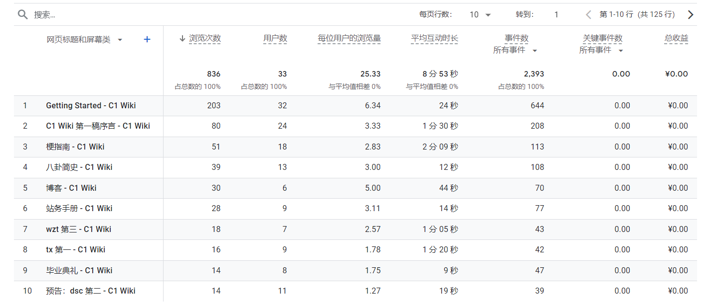
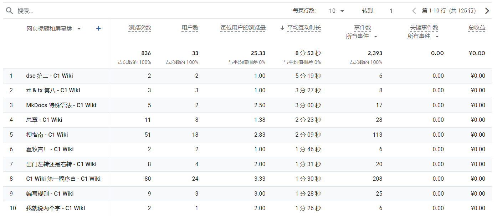

---
authors:
  - WillHou
categories:
  - log
date:
  created: 2024-08-31
  updated: 2024-08-31
---

# C1 Wiki 大事记：TO BE CONTINUE

8 月 18 日惨不忍睹的上线仪式，宣告了 C1 Wiki 第一期工程的圆满结束，第二期工程顺利开始！

<!-- more -->

## 第一期工程：成果小结

在第一期工程中，我们取得了丰硕的成果。在内容方面，我们完成了 $65\%$ 的梗指南，五篇八卦简史；档案袋和博客更新没有确定的计划，想到啥更啥。

下面是流量监控的数据，有几组数据蛮有意思的，可以跟大家分享。

### 数据一：读者信息

截止到本文写作时间，本站共收获了 $33$ 名读者，平均每位读者阅读了 $10$ 分钟。神奇的是，有一位读者 ip 地址在日本。不知道是旅游还是梯子。

### 数据二：浏览次数排行榜

上图是另一组很有意思的数据。除去首页内容和分区首页内容，本站流量最高的三篇文章是：wzt 第三，tx 第一，dsc 第二。（wzt 的热度居然比 tx 还高？）全部被八卦史包揽！

### 数据三：阅读时间排行榜

当然，浏览次数可能存在水分，但阅读时长是实打实的。

可以看到，本站阅读时长最长的三篇文章是：dsc 第二，zt & tx 第八，MkDocs 语法指南。八卦史再次包揽前二！

## 第二期工程：未来展望

第二期的主题为“共创”。仅凭我们的单薄之力，难以完成 C1 Wiki 这样的项目，所以需要更多的同学分享他们的视角下的故事。目前，我们有如下内容更新计划，有些已经在进行，有些尚未开始：

- 图说：收集一些初中照片。灵感来源于骞老师分享的刘总传记。后面我们可以把毕业相册搬进来。（预告：如果 xmy 本人没有意见，可以跟大家分享一下牧言九图）
- 如何：这是 cjs 的好点子，我们发现这正好是我们计划中的“违纪纲目”的很好的表现形式
- 若可文集：若可太能写了，单独开个区吧。

但是，随着九月的邻近，同学们的高中生活即将开始。这宣告了 C1 Wiki 注定会停更不短的一段时间。所以，第二期工程的预计工期非常长，甚至会无限期停工。

不管怎样，初中四年的印记注定不会消失，回忆仍然属于每一个人。只要记忆犹存，C1 Wiki 就没有停工。

祝愿 C1 Wiki 二期工程圆满完成！