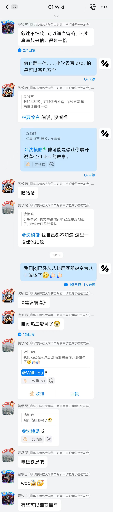

# 八卦史·dsc 第二

上篇文末我称她为“忧郁魔女”，这是我临时想出来的称呼，并不是什么正式的绰号。这称呼给她披上了一点浪漫色彩，我觉得很合适，像是她，又不像是她。

她无论对男生还是女生都很开朗，成绩也一直不错。她很聪明，我印象中每次一有新的科目成为考试科目，第一次考试她总是全班第一。若是交往一阵子，你可能根本感觉不到“忧郁”和“魔”，反而还要说是我在扣帽子。

那我能怎么说呢，对她，我总是无话可说。

她的性格在初中四年是有变化的，这么说不少人可能觉得很有道理，但细细推敲好像也没什么道理。有什么变化？也还是那样，她也说自己没什么变化，一直心思很重。甚至于我本人也跟她说：你还是这样。

再多说几句，她就生气了。她基本也只对我生气。

“主观色彩过于浓重”这句话你会在什么时候说？可能会用来某种言论和看法，可我现在要用这八个字评价这个人。不同人对她的认识差距很大，每个人都以主观视角看她，在心中贴下自己的标签。很少会跟别人分享自己的标签是什么，所以大家都认为自己的看法是客观的。

至于她自己给自己贴的标签是什么？我想也就这四个字：“忧郁魔女”。

据不完全统计喜欢过她的人有 $11$ 个，比 tx 还多，应该是我们年级第一大白月光了。喜欢她的原因差不多是一致的，这里面包括作者早期。总之就是觉得她长得很好看，很可爱，很开朗，或者误认为她也喜欢自己。六年级时的情况是很炸裂的，她先是喜欢 zt，后来是 ztr，据说中途还喜欢过 jcj。当时她的“官配”cp 是 ztr，俩人每天关系很好，ztr 也承认了双向奔赴，然而后来她又答应了 tyy 的表白，主要是不知道该怎么去拒绝。当时周一下午拓展课，她在古诗文班，于是古诗文班又被“大闹”一场：xmy 当时纯乐子人，天天跟她聊天，甚至是一些不堪入耳的带颜色的内容，具体的话语过于炸裂这里不便描述。到了期末考试仍死性不改，考了个全场最低分，满分 100 考了 30 几，人家 dsc 还 80 多。后面的偷卷子事件也是家喻户晓，咱 xmy 大脚一踢踹开办公室门，大手一挥从柜子里偷出卷子，大嘴一张跟 dsc 炫耀，再次大脚一踢进入办公室，再次大手一挥偷出卷子，再次大嘴一张，这次是跟二班人炫耀。这回不再循环，大眼一蹬被传唤进办公室，紧接着小头一低承认错误开违纪单，dsc 也受波及，于是从此之后俩人关系就此急转直下。

上面纯搞笑，只是早期 dsc 和他的关系确实十分好，还引起了 ztr 的吃醋。古诗文班不止这一位，还有二班 ssh，那天晚上小黄人满脸兴奋的跟我讲：“今天你们班的一个女生和我们班的一位男生要在古诗文班干出些大事！”虽然不知道具体是什么，后面 ssh 也澄清和 dsc 只是朋友……

八卦不止这些，当时在外班还有 myx 和 hsr 也传出来过，本班还有 zyp，而以上仅仅只是六年级一年。该怎么说？这难道还不能说她在初中性格有过变化？这和忧郁魔女有任何关系吗？

真的没关系吗？至少，“魔”已经初步展现了。

所有喜欢她的人没人知道自己为什么喜欢她，当然可以说是心思尚且单纯，然而呢？

有人说她是渣女，可在这情窦初开的年纪我并不认为可以去认定任何一个人“渣”，因为这个词的意思还没有在我们的观念里形成。她只是觉得好玩——真心这么觉得。而我们也只是觉得开心——真心这么觉得。只不过她的对象多了一些。

从这里，能看出“忧郁”的种子吗？

这段时间的一切给大家留下了深刻的印象，第一批“标签”已经在各个人心里形成。

紧接着到七年级，她破天荒的答应了 dhz 的表白。从此六年级的那一些和 dsc 玩的好的男生就此退却，此时她的心理是什么？我也不清楚。各种炸裂的事情再次上演，不便在此过多叙述，最经典的就是综合楼事件了。

第二批标签形成。

那时我很绝望，然而她跟我的关系却非常好，dhz 天天吃醋，dsc 反而还跟我吐槽 dhz，说让我不要理他，他很烦，然后继续跟我关系好。

这让我产生了误解，因为在我当时单纯的大脑中，跟一个人关系好就是喜欢这个人。

这样矛盾的情况持续了两个多月，直到七上寒假。

这个寒假对我来说风平浪静，对她来说，她和 dhz 分手了。

寒假结束后，重新开学，我至今记得重逢后她投给我的第一个眼神。

和以前一样吗？一样。

但是多了一点亲切的感觉，可又有一点点空洞。

从此这样的眼神跟随了我很久，直到八上寒假。

客观世界中发生了什么事情？lyy 开始喜欢她，后来 zt 也开始喜欢她。zt 表白了，我也表白了，但都被拒绝了。

那时外界的评价，是我能够听到的，对我，对她，都算是正向的。

当然，我听到的而已。

最后一次看到这个眼神是在疫情网课前的最后一个上午，她帮我发数学练习册，把我的练习册递给我的那一瞬间。

又到寒假了，对她，风平浪静。对我，我不喜欢她了，还有 zt，也不喜欢她了。

到了八下，又是开学第一天的第一个眼神。

和以前一样吗？一样。

但是，我分明感觉那亲切的眼神背后，有一丝冷酷。

一切正常，正常的交流，和以前一样，直到我写的关于 hl 的一篇文章被她看到后。

那节美术课我们仍然正常的聊天，她问了我一堆问题，心平气和的问。我也回答了那些问题，心平气和的答。我那时以为她已经放下那些过往，准备直接去和 lyy 在一起。

美术课下课，她走了。

从那以后，流言四起，关于我的，关于她的，但我不再听到这些评价了。抬头看去，周围的班级风平浪静，但我知道，一种新的标签正在这班级里每个人的心中形成。

从那以后，我再也看不到她的眼神了。

最后一次看到是在九上那次一起去考试中的华二校园里，她的眼神满是温柔，平静，没有任何多余的东西。

于是一切都结束了，最后的一年间我们不再有任何的交流。因为任何交流的后果是：在几天后，我会听到某个人跟我说，“嘿，dsc 又在跟别人骂你呢。”

于是我很生气，和这个人骂她。

就这样一直到了中考以后，我考了 $706$，她考了 $701.5$。我没有多想什么，分数线出来后我差了一点上华二，进了建平。懊恼之余突然又想起她。

“她不会一起跟我进建平吧！哎呀不会真的这样吧！他妈的要气死我了！”我跟我的朋友大声抱怨。

我的朋友默默翻着分数线，突然看到复附浦东的到校分数线是 $701.5$。

“没事没事！别担心！她进复附浦东了！哈哈太好了！”我的朋友开心的拍拍我的肩膀。

我也跟着笑了笑，附和了两句。

可在那一瞬间我突然有了一种无法言说的失落。哦，我忘了，她喜欢复附系，我怎么不把复附浦东填在建平前面呢？

我的大脑中闪出一些影子，她的各个时期的影子；闪出一些标签，她的各种各样的标签；闪出一些眼神，她的各种各样的眼神。我突然回到了曾经那段光明的岁月中看最初的她。

和现在的她，有任何的区别吗？

是我在变，是她心中的我在变，所以我眼中的她在变。

忧郁魔女。

“我觉得我没有带给你任何，我浪费了你三年的生命，情感……”

“你不要试图去懂我，没有人能懂，我自己都不能……”

……

我爱她那表面背后深不可测的内心，我爱她那幽怨的眼神中蕴含着的内心的出口。我可怜她总是带着虚假的伪装，我可怜她在虚假的伪装后忧郁的心。我想打破那最坚硬的心防，我想见到那层忧郁背后炙热的温柔。我在她的魔力中沉醉，挣扎，挣脱。可我无法逃避，那一点星光，是那么遥不可及……

可她不爱，她不可怜，她不想。

我没办法再喜欢她。