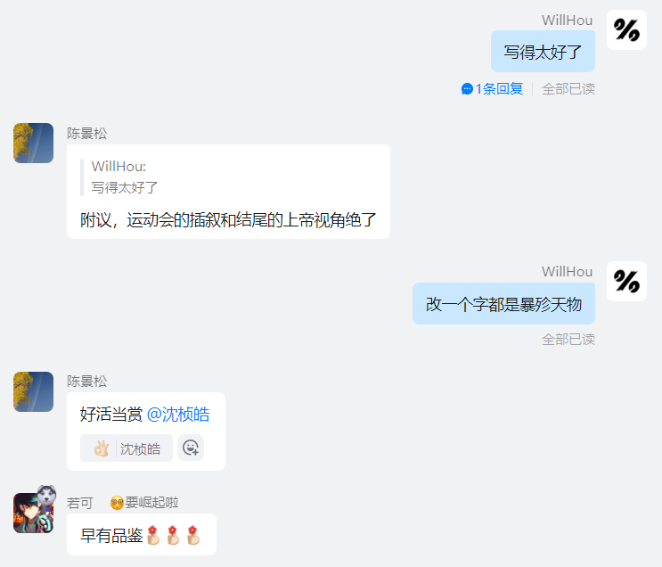

# 八卦史·zt-tx 第八（全程高糖）

【本文是作者 szh 站在 zt 第一人称视角写的】

……

当思念像秋雨

寂寞

萧索

我看不了口

日记本里躺着的钢笔

诉说止于唇间的秘密

当思念像冬雪

堆积

压抑

我无法逃避

我是覆雪窒息的鸟儿

凝望你 你知道我的心意

……

我和她不在一个班，但她是引起我注意的第一个女孩。入学的第一次期中考试，要分考场。我以年级第六名的身份坐在第二列第一排，左后方有一个女生，静静地低头看书。

后来考场里的人多了，都是年级里的佼佼者。大家都在东张西望的聊天，我也回过头去跟新认识的同学聊两句，余光第二次撇到那个女孩，仍然静静的坐在那，书靠在桌沿上，底端放在大腿上，低着头，一动不动地看书。

很快监考老师走了进来，考试要开始了。周围的同学们开始紧张，这时不知由谁发起的，说要拜考神，于是大家都向右挪动身子，对着我的右后方拜着，动作最滑稽的莫过于坐在我左后方的作者。我回头看去，那个女生终于抬起了头，笑着四下望望，似乎有些腼腆，但更多的是一种自信。

我是个很自负的人，我很清楚，但我又很享受那种感觉。这时我的攀比心突然爆棚，切，不过比我考高了3名，这次考完我肯定比她厉害，有什么好拜的！

呀，怎么回事，我心里想的怎么不小心说出来了？

那时我没发现坐在我左后方的作者对我投来异样的眼光，显然是听到了我说的话。

直到考试结束我才直到她叫谈欣，是一班的班长。真特殊，跟我一样是两个字的名字。这时一种无名的好奇心突然从心中升起，我回头看向她，她带着口罩，回过头去，马尾辫轻轻甩了一下，接着静静的从后门离开了。

这次考试考完，她是年级第一，而且和第二还有不小差距。我霎时间肃然起敬了。

之后呢？好像也就没什么了，紧接着到了期末考试，这回我坐在了她上次坐过的位置上。她坐在我前面，第一排的第一列，属于年级第一的位置。还是那样，低头看书，没有多余的动作。哦，好像有多余的动作，就是她每过个几分钟就要把她的手放在脖子上，我看了半天才弄明白原来是手太凉，放在脖子那暖暖。

哈哈，怪可爱的。

想到这是她原来的座位，我一举一动都不由得小心翼翼。为什么呢？我好像也不知道。

突然前面的女孩回过头来看了我一眼，我紧张的一动不动，盯着她的眼睛。她歪了一下头，就把眼神移到别处。我的心跳不知为何突然加速，直到我发现作者竟然走到她旁边跟她聊天。这一下子我心脏可不跳了，我紧紧盯着他俩，还好没说几句话，作者就走了。

那天晚上我回家想了一想，我莫非是喜欢上这个女孩了？我被这种想法折磨的睡不好觉，直到第二天早上上学，看见她背着粉红色的小书包，踏着阳光走进教室，我的内心终于宁静了。

我把这件事告诉了一些我最好的朋友，怕他们外传，于是我就跟别人大肆宣扬，说我喜欢三班的那个英语课代表。这下不少人都相信了，因为我就是二班的英语课代表，经常一起到英语老师那问作业，发卷子什么的，旁人看来很有发展的机会，于是八卦声几乎传遍了整个年级，连一班的作者也听闻了这个消息，并信以为真。这时我心里暗自窃喜……

六下的第一次月考，马上要发语文卷子时突然听到背后有窃窃私语声，我回头看去，我的好朋友怎么在和 别人隔空说悄悄话？那边有人轻轻的说了一声，“谁呀！”这时我的好朋友张大嘴巴，做出了“谈欣”的嘴型……

下课我去质问他，他却说是对方用真心话大冒险猜出来的。这下可好，关于我喜欢tx的八卦瞬间火遍全年级，甚至连办公室的老师都耳熟能详。

见此情景我也只好大方的主动承认，之后就在线上和一些学校拓展课的时间找机会和她接触。相处的机会不多，但是我越发迷上了眼前这个女孩。说话之前总要青涩的清清嗓子，摆出一副庄重的摸样，嘴唇却已经急不可耐地抬了起来。下课的时候累了，她会趴在桌上睡觉，手在桌子上围成环形，左脸压在桌上，再抬起头时左半边还要花个两秒钟才红彤彤的恢复原样。有时无聊就拿出铅笔在桌上画画，或者英语书上，我偶尔有机会坐在她旁边时，她就笑着拿出刚画好的美少女战士给我看。呀，忘记说了，她的两个耳朵后面都有一个小黑点，说是天生，我看更像是哪个调皮的小孩用记号笔轻轻点了两下，怪可爱的。她真的好自信，好有气质，艺术节上她弹吉他唱歌，我默默坐在下面，目不转睛地盯着她看。

就这么愉快的度过了一年，很快到了七下疫情。我几乎是天天跟她聊天，从早到晚，接连不断。虽然长时间不见，但她趴在桌上目不转睛用铅笔画画的样子时常出现在我的心中，每次出现，我的内心就会颤动一下，随之而来的是那种难以言说的幸福。但是她好像总是联合别人一起来捉弄我，有一次还故意跟我表白，然后说是真心话大冒险输了，我对她的一些暗示她好像总是视而不见。她还经常冒充她妈妈来跟我聊天，有时还会说出些过分的话，说实话有几次我还是很生气的，但对她也总是拉不下脸，去宽容一下吧，追求别人的过程哪有那么容易呢。

可这次，我却实在是宽容不了了。

有人跟我发了一个聊天记录，里面是一个男生说让她叫他老公，结果，她竟然毫不犹豫的叫了，后面还有一些很亲近的对话。

我追了这么久，花了这么多时间，就是这个下场？呵，我这么优秀，对你卑躬屈膝这么久，你把我当作什么？

于是我就开始和别的女生聊天，那时的思路很奇怪，就是想通过这种方式寻求一种慰藉。于是我跟 dsc 玩真心话大冒险，我输了，要找一个女生换情头。

我毫不犹豫的选择了她本人，换好后我莫名其妙的觉得很开心。当然，不至于这么快移情别恋，不过还要看看 tx 的态度。

我去跟作者聊天，我知道作者喜欢 dsc，但我还是说：

“如果初中这两年能重来，我一定去喜欢 dsc。”

之后的几个月，她竟然真的再也没有理过我。我可不愿放下身段去找她，我天天和 dsc 聊天，也挺开心，人家 dsc 也没哪点不如你。

直到哪里开始忏悔？表白被拒绝的时候？看到 dsc 和她们班的一个男生换情头的时候？再度表白结果被模糊不清的应付的时候？还是在夜深时重新想起她的时候？

我不知道是什么时候，但我明白，此时的忏悔已经没有意义了。

难道，她还会给我第二次机会吗？

我想去挽回，但我明白肯定是收效甚微。那是一段漫长而煎熬的过程，每次看到她去饮水机接水，我就拿着水杯出去假装偶遇，期望能够搭上两句话；每次看到她下课时开心的和别人聊着天，我也只能从窗外默默望着，想着之前和她一起看恋爱番的下午；每次看到她走在身前，我多么想加快脚步冲上前去，可又被周围的凝固的空气死死按住，无法再向前一步。默默地，看着她，幻想着她能回头……

九上的那次春游去迪士尼玩，我在线上苦苦恳求，终于得到了和她一起玩的机会。比起玩项目，我更喜欢和她一起排队的时间。我希望队伍能长一点，再长一点，这样我就可以以人多为由靠近她半步，和她多说几句话。吃晚饭时我不敢坐在她旁边，只是默默坐在她的斜对角，在她和别的女生聊天时插几句话。晚上，玩到很晚才回家，我陪着她走到地铁站，明亮的灯光下映着她逐渐远去的背影，周围喧闹的人群仿佛安静了下来，在眼前的一片空旷中她越来越小，她轻轻握住扶手，走下两级台阶，在即将消失在视野中的一瞬间，她忽然停下。

她回过头来。

那一刻的眼神瞬间穿过几十米空间，直击我的心灵。她还是那么美……

几天后的运动会上，我站在男子 $1000$ 米的跑道上，她静静站在起点处的一个不起眼的位置上。鸣枪起跑，我以最快的速度冲向前方，过了两圈就把处在第二名的作者远远拉在身后。可超出平常的负荷让剩下的路程异常煎熬，跑到 $600$ 米的位置，我感觉我的心肺已经完全到了极限，小腿中的血液仿佛凝固。

我真的跑不动了。

这时，一个声音对我说：

再坚持一下，再过 $150$ 米，我就能再看到她了。

我再次抬起头来。汗水模糊了双眼，红色的大地在眼前摇曳，周围的一个个人影在一片白茫茫的虚空中涌向身后，直到她的脸在虚空中清晰，她的双眼在风中矗立，她的心在我的心中呐喊……

当思念像秋雨

寂寞

萧索

我开不了口

日记本里躺着的钢笔

诉说，止于唇间的秘密

当思念像冬雪

堆积

压抑

我无法逃避

我是覆雪窒息的鸟儿

凝望你

你知道我的心意

……

“我一直很喜欢他啊。”

“女生肯定要矜持一点，但我觉得我已经表现的很明显了啊。”

“我那时还奇怪他怎么这么久不和我说话，直到那天，我看到他跟 dsc 换情头。”

“很生气啊，努力去忘记，但是我真的一直很想他，那天，我真的受不了了，就写了这首诗。”

“哎，你说他睡不着，还不找我聊天，他是不是不喜欢我了？”

“哈哈，他又理我了。”

……

冲向终点，我累的瘫倒在地上，旁边人祝贺我破了校运会纪录。我扭头去看她，她的眼神也似乎在闪着光。

后来吧，一切就都像是发生在梦中了。圣诞节互送圣诞礼物，寒假是我们第一次出去约会，我们一起去逛街，去吃饭，去 ktv 唱歌，一起在风中携手向前走……

中考考完了，我们都没考好。但没关系，有彼此的陪伴，无论遇到什么困难我们都会在一起共同度过。感谢你给了我第二次的机会，感谢你又爱了我第二次，而这一次我绝对不会再错过，我愿执子之手，在青涩中不断成长，在青春中看到属于我们的独特风景，在纯净中体会那份爱与责任，在一次次惊喜中感受那一个个瞬间幸福的火花。无论能否与子偕老，这段互相陪伴的时光，永远是我最珍贵的回忆。

……

他的十五岁生日那天，她来陪他一起过生日。在一片漆黑的电影院中他们肩并肩坐下，看着眼前的男女主角在历经沧桑后重逢时激情热吻的画面，他轻轻握起她的手。

“你的初吻还在吗？”

“当然了。”

“哈哈，那我可真是太幸运了。”

于是，他们成为了他们各自电影中的主角，绝对的主角。